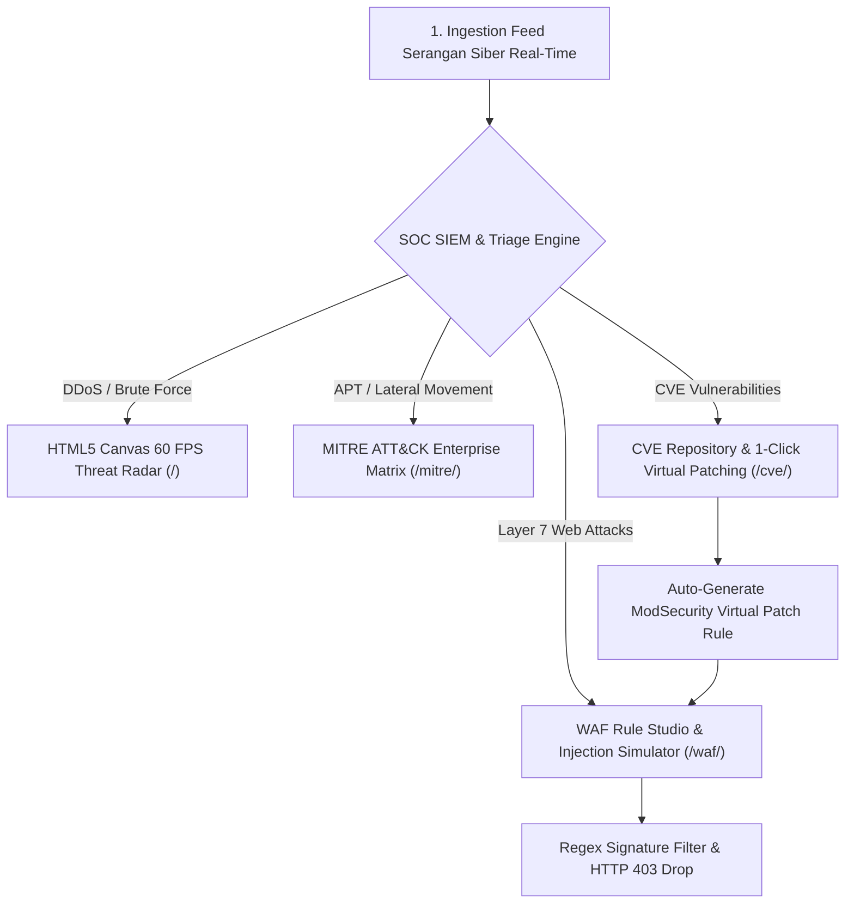

# 🛡️ AegisSec OS — Enterprise Cyber Defense, SIEM & SOC Threat Intelligence
### The 10th Titan (The Decagon Milestone — 100M+ Local Tokens Burned)

[](https://olyxmintabansos-byte.github.io/aegissec-os/)
[](https://olyxmintabansos-byte.github.io/aegissec-os/)
[](https://olyxmintabansos-byte.github.io/aegissec-os/mitre/)
[](https://olyxmintabansos-byte.github.io/aegissec-os/waf/)
[](https://olyxmintabansos-byte.github.io/aegissec-os/cve/)

---

## 🌐 Live Production Routes (100% Client-Side Local-First)

- **Pusat Komando SOC (Radar 60 FPS):** [https://olyxmintabansos-byte.github.io/aegissec-os/](https://olyxmintabansos-byte.github.io/aegissec-os/)
- **MITRE ATT&CK Enterprise Matrix:** [https://olyxmintabansos-byte.github.io/aegissec-os/mitre/](https://olyxmintabansos-byte.github.io/aegissec-os/mitre/)
- **WAF Rule Studio & Payload Simulator:** [https://olyxmintabansos-byte.github.io/aegissec-os/waf/](https://olyxmintabansos-byte.github.io/aegissec-os/waf/)
- **CVE Repository & NIST Playbook:** [https://olyxmintabansos-byte.github.io/aegissec-os/cve/](https://olyxmintabansos-byte.github.io/aegissec-os/cve/)

---

## 🏛️ System Architecture



---

## 💎 Fitur Unggulan AegisSec OS

1. **HTML5 Canvas 60 FPS Threat Radar (`/`)**:
   - Sapuan rotasi 360° menggunakan trigonometri polar-ke-kartesian murni tanpa overhead DOM.
   - Pendaran target (*blips*) dinamis dengan kode warna berbasis tingkat keparahan insiden.
2. **MITRE ATT&CK Matrix Heatmap (`/mitre/`)**:
   - Matriks 8 taktik enterprise: *Initial Access, Execution, Persistence, Defense Evasion, Exfiltration*.
   - Pemetaan langsung insiden aktif ke nomor teknik MITRE (e.g. T1059, T1190, T1558).
3. **WAF Rule Studio & Threat Injection Playground (`/waf/`)**:
   - Pengujian payload serangan sintetis (SQLi, XSS, Path Traversal, SSRF) secara real-time.
   - Hitung latensi regex sub-millisecond dan aksi pemblokiran otomatis.
4. **CVE Repository & 1-Click Virtual Patching (`/cve/`)**:
   - Kalkulator metrik keparahan CVSS 3.1.
   - Tombol 1-klik *Deploy Virtual Patch* yang otomatis menerbitkan aturan WAF dan menyelesaikan insiden aktif.
   - Generator dokumen *NIST SP 800-61 Incident Remediation Playbook* berformat cetak A4 resmi (`window.print()`).

---

## 🛠️ Verification & Build Instructions

```bash
# 1. Pastikan public/.nojekyll ada
touch public/.nojekyll

# 2. Build static export
npm run build

# 3. Buat out/.nojekyll
touch out/.nojekyll

# 4. Commit dan push ke branch master
git add .
git commit -m "feat: complete AegisSec OS Sprint 3 & 4 - WAF Studio & CVE Virtual Patching Engine"
git push origin master || git push origin main

# 5. Deploy ke GitHub Pages
npx --yes gh-pages -d out -b gh-pages --dotfiles
```
